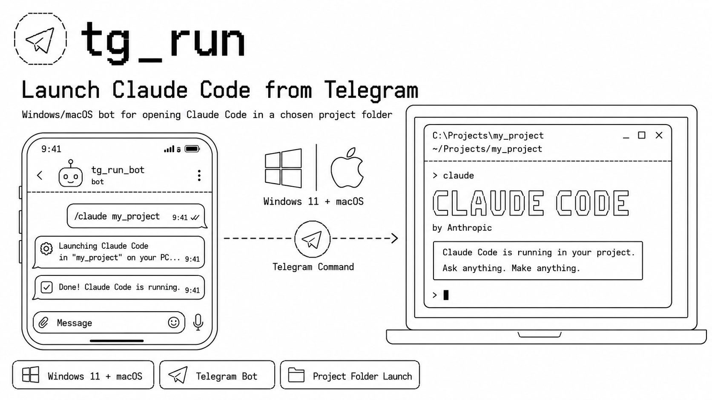

# tg_run — launch Claude Code from Telegram

A Telegram bot for a home PC (Windows 11). On a command from your phone it opens
a terminal window (Windows Terminal) on the computer with `claude.exe` running
in the chosen project folder. From there you keep working remotely straight from
your phone via Claude Code's own Remote Control ([see below](#continue-from-your-phone)).

## Commands

| Command | Action |
|---|---|
| `/claude <folder>` | Open a terminal with Claude Code in a project folder |
| `/list` | List projects in the base directory |
| `/id` | Show your Telegram ID (for access setup) |

If the folder is not found, the bot offers a button to create it and launch
right away.

## Continue from your phone

Once the bot has opened Claude Code on the PC, you can keep steering that same
session from the [Claude mobile app](https://claude.ai/download) (or
[claude.ai/code](https://claude.ai/code)) via Claude Code's
[Remote Control](https://code.claude.com/docs/en/remote-control). Claude keeps
running locally — the phone is just a window into the session.

For every launched session to show up on your phone automatically, run `/config`
inside Claude Code once and set **Enable Remote Control for all sessions** to
`true` (or Desktop app: **Settings → Claude Code → Enable remote control by
default**). Without it, you'd have to type `/remote-control` in each session by
hand.

Requires signing in with a claude.ai account (Pro/Max/Team/Enterprise) via
`/login` and Claude Code v2.1.51+. Then open the app, tap **Code**, and pick the
session from the list.

## Quick start

Requires [uv](https://docs.astral.sh/uv/) and Windows 11.

```powershell
git clone <repo-url> C:\tools\tg_run   # clone into a PERMANENT folder (see note below)
cd C:\tools\tg_run

copy .env.example .env                  # then edit .env: paste your BOT_TOKEN
copy config.example.toml config.toml    # then edit config.toml: base_dir, allowed_user_ids

uv sync                                 # create .venv and install dependencies
uv run bot.py                           # first run in the foreground to check it works
```

Get your token from [@BotFather](https://t.me/BotFather). Then send the bot
`/id` to learn your Telegram ID, put it into `allowed_user_ids` in `config.toml`,
and restart. Once it works, set up autostart (below).

> **The bot runs from this folder — keep it in a permanent location.** Nothing
> is copied elsewhere: the code, `.venv`, `.env`, `config.toml` and `bot.log`
> all live here, and the scheduler task points at this path. If you delete or
> move the folder, the bot stops working (after moving, re-run
> `install_task.ps1` to re-register the task with the new path). Put it
> somewhere stable like `C:\tools\tg_run`, not in Downloads or a temp folder.

## Configuration

- `.env` — `BOT_TOKEN` (not committed; copy from `.env.example`).
- `config.toml` (not committed; copy from `config.example.toml`):
  - `base_dir` — the base directory with projects (launching is only possible inside it);
  - `allowed_user_ids` — the list of Telegram IDs allowed to launch;
  - `allow_create` — whether new folders may be created;
  - `command` — the terminal launch command (`{path}` is substituted).

## Autostart in the background

To run unattended and start at every log on, register a Task Scheduler task
(from the project folder):

```powershell
powershell -ExecutionPolicy Bypass -File .\install_task.ps1
```

Manage it:

```powershell
Start-ScheduledTask tg_run                                      # start
Stop-ScheduledTask  tg_run                                      # stop
powershell -ExecutionPolicy Bypass -File .\uninstall_task.ps1   # remove
```

Don't also run `uv run bot.py` at the same time: two polling clients on one
token cause a `409 Conflict`.

## More

See **[DETAILS.md](DETAILS.md)** for how it works under the hood — the autostart
mechanism (supervisor, auto-restart, no-console launch), logging and error
alerts, the security model, window behavior, and Claude Code's folder-trust
dialog.
